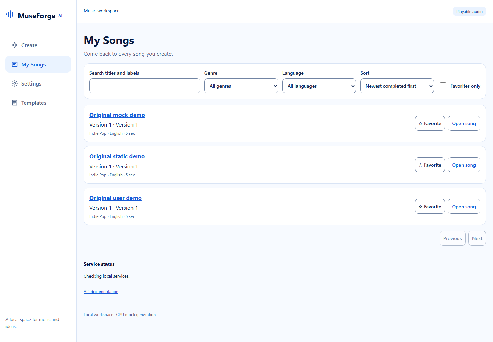
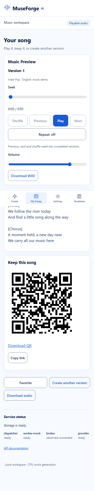

# MuseForge AI

Turn a musical idea into a playable song. Describe the sound, choose instruments, mood, language, genre and lyrics, then let MuseForge generate and save the result. **My Songs** keeps every completed version ready to play, download, favorite, or revisit from a QR code.



## Create, listen, and return

1. Open **Create**, describe the song, and choose its musical controls.
2. Generate it. Progress, cancellation, retry, and draft recovery remain available while MuseForge works.
3. Open the result from **My Songs** to play it, read its lyrics, download the audio, or create another version.
4. Configure `SONG_LINK_BASE_URL` with an address reachable by your phone to copy or download a permanent song QR code.



## Set up MuseForge

The standard setup creates a real YuE2 environment and the standard start command selects the real provider:

```bash
bash scripts/setup.sh
bash scripts/start.sh
```

This requires the verified weights volume and suitable CPU or NVIDIA GPU resources. `DEVICE=auto` uses CUDA when the Docker engine exposes the NVIDIA runtime.

### Mock provider

Use the mock provider when you want to evaluate the product without installing YuE2 weights or configuring a GPU:

```bash
bash scripts/setup.sh mock
bash scripts/start.sh mock
```

Open the printed address, normally `http://127.0.0.1:8000`. Set `APP_PORT` in `.env` when that port is occupied. This command explicitly selects the mock provider, which creates clearly labelled demo audio. For generated songs, follow the real YuE2 deployment section in the [new-machine deployment guide](docs/new-machine-deployment.md). YuE2 has narrower documented capabilities; generated audio may not follow requested lyrics, vocals, musical controls, or exact duration.

```bash
bash scripts/start.sh mock --create-only
```

Set `CONTAINER_RESTART_POLICY=no` in `.env` to prevent containers from returning after Docker restarts. The default is `unless-stopped`.

```bash
bash scripts/logs.sh
bash scripts/migrate.sh
bash scripts/stop.sh
bash scripts/test.sh unit
```

Data volumes survive normal stop/start. Start with the [new-machine deployment guide](docs/new-machine-deployment.md). See the [development guide](docs/development.md), [deployment handoff](docs/deployment-handoff.md), [model boundary](docs/model-integration.md), and [Phase 07 plan](docs/implementation/phases/07-song-first-experience/plan.md) for deeper reference.

QR links remain useful while their configured base address, this server, and the saved song are available. Network exposure, authentication, and public hosting are operator responsibilities.
