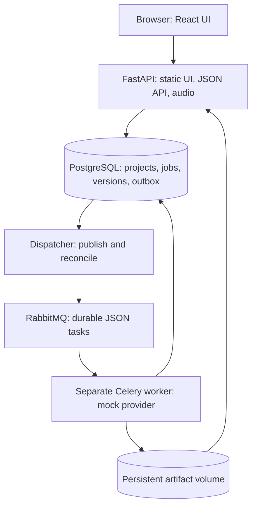

# MuseForge AI portable application master plan

- Plan date: 2026-09-13
- Scope: Part 1 portable application plus Part 2 model integration and deployment handoff.
- Implementation branch: `codex/phase-6-completion`; integration target: `main`
- Baseline commit: `ac46f5a535e4461250322351e31b3433bbf96988`
- Execution state: Phases 00–07 are complete on their recorded gates. [Phase 07](phases/07-song-first-experience/plan.md) delivered the song-first experience and flexible startup without repeating CPU inference.

## Outcome and source of truth

Deliver a local single-user web application in which a brief becomes preserved lyrics and playable audio through a real API, PostgreSQL, broker, and separate worker. Refinement and variation create immutable versions; reopening a project restores its saved draft, selected version, lyrics, and audio. Part 1 proves the complete system using clearly labelled mock music. It does not claim that demo audio sings the supplied lyrics.

The requirements are [Part 1](../prompts/01-portable-application.md), [design.md](../../design.md), and the [desktop](../ui%20mockups/mockup_desktop.png) and [mobile](../ui%20mockups/mockup_mobile.png) references. The companion [Part 2](../prompts/02-machine-deployment.md) defines the later machine and real-model work. The prompt's explicit capability and scope rules govern where reference artwork suggests unavailable features.

## Repository assessment and assumptions

The Phase 00 baseline contained those five reference files only. The portable
application and its Phase 01–03 records now exist on the implementation branch.
No applicable `AGENTS.md` was found at the repository, its ancestors, or within
the repository. Both reference images were inspected and remain unchanged. Their
older descriptive filenames in `design.md` refer to the two actual files linked above.

The Phase 00 authoring environment was Windows/PowerShell, with Python 3.14.2, Node 25.2.1, and npm 11.6.2 observed. `docker` was not discoverable on this shell's PATH. This does not establish whether another engine or WSL installation exists. Host inventory and changes are Part 2 work. Planning is not blocked; container acceptance will require a Linux container engine in Phase 01. The application runtime is the separately pinned Linux image, not these authoring runtimes.

Assume one trusted local workspace, a loopback application port, no accounts or paid service, CPU mock generation, and persistent named volumes on one host. The
portable application still defaults to mock generation. YuE2-3B is selected for a
bounded Part 2 integrated route and is available through an explicit real-worker
Compose profile; it is not the default provider. The repository name does not
select a model. Default port 8000 is
configurable and is not asserted available on any target machine.

Phase 01 was implemented from Linux and verified on the user-supplied Docker VM at `10.42.0.42`; see its [evidence](evidence/01/2026-09-13-foundation/README.md). The baseline environment observations above are historical.

## Architecture and stack

The API never imports inference runtimes or loads weights. The dispatcher uses the same application package for outbox publication and recovery; it performs no inference. PostgreSQL owns product state. Celery has no result backend. A filesystem adapter publishes validated audio atomically; the API reads it using opaque artifact IDs and supports range requests. The compiled SPA and all browser endpoints share the API origin.

Use Python/FastAPI/Pydantic, SQLAlchemy/Alembic with psycopg, PostgreSQL, RabbitMQ/Celery, React/TypeScript/Vite, pytest, and Playwright. [Dependency baseline](dependency-baseline.md) records selected exact versions, image digests, compatibility evidence, and the Phase 01 lockfile gate. [ADR 0001](decisions/0001-application-architecture.md) records the choices and consequences. [Contracts](contracts.md), [job reliability](job-reliability.md), and [UI behavior](ui-behavior.md) supply implementation decisions shared by every phase.

## Scope and explicit deferrals

Included: three lyrics modes; composer selections; asynchronous generation; real playable demo WAVs; progress/cancellation/error states; full player; immutable iteration and variation; project/library organization; local draft recovery and server save/reopen; templates and local preferences; capability handling; reproducible containers; tests and operating documentation.

Deferred product validation: broader real-provider capability and recovery
checks, semantic audio quality, and native-Linux execution remain explicitly
unverified. Part 2 D04/D05 deployment validation, backup/restore, rollback, and
operations handoff are recorded as complete in the merged deployment reports.
The normal-mode CPU release gate passed on Ubuntu1 with the pinned weights and
is recorded in the Phase 06 completion evidence. The final browser-profile
correction was retested separately at the final implementation revision.

Deferred product scope: collaboration/comments, billing/credits/upgrades, notifications, multi-user permissions/authentication, public exposure, DAW stems, and multitrack notation. Omit those controls in Part 1. Keep every required local Create, Library, Projects, Settings, Templates, Advanced Options, and version action accessible. Optional decorative waterfront art is not a release gate. No fixture, example duration, or version count is presented as a measured live result.

## Phase sequence and dependencies

| Phase | User-visible or enabling deliverable | Depends on | Exit gate |
| --- | --- | --- | --- |
| [00 Discovery and contracts](phases/00-discovery-and-contracts/plan.md) | Audited references, decisions, actionable plans and tracking for every phase | Baseline references | Complete documentation, requirement mapping, honest status and planning audit |
| [01 Foundation](phases/01-foundation/plan.md) | Reproducible stack; API serves a built UI shell | 00 | Locked build, controlled migrations, healthy DB/broker/dispatcher/mock worker and correct static routing |
| [02 Mock end-to-end](phases/02-mock-end-to-end/plan.md) | Brief and lyrics reach the worker and return playable persisted demo audio | 01 | Browser submission crosses real services, survives refresh, preserves lyrics and plays decoded audio |
| [03 Complete responsive workspace](phases/03-complete-responsive-workspace/plan.md) | Designed composer/player/lyrics/iteration/history with responsive and accessible behavior | 02 | Wired controls, desktop/mobile/keyboard checks against the API-served UI |
| [04 Projects, versions, and recovery](phases/04-projects-versions-and-recovery/plan.md) | Complete library/save/preferences and verified concurrency, cancellation and recovery | 03; core persistence/reliability starts in 02 | Immutable history, organization flows, race/fault tests and reconnect handling pass |
| [05 Provider readiness](phases/05-provider-readiness/plan.md) | Audited capability UI/API and model integration handoff | 04; interfaces start in 00–02 | Honest capability matrix, isolated worker configuration and no silent real-to-mock fallback |
| [06 Release verification and handoff](phases/06-release-verification-and-handoff/plan.md) | Clean-checkout mock release, normal CPU model verification, and reproducible operating/development instructions | 01–05 | Mock and CPU gates pass with traceable evidence and current phase reports |

Critical path: `00 -> 01 -> 02 -> 03 -> 04 -> 05 -> 06`. Contracts and evidence are refined as implementation reveals facts. Basic idempotency, transactional outbox, claims, artifact validation, and version uniqueness are part of Phase 02, not retrofits postponed to Phase 04. Phase 04 supplies exhaustive fault/race verification and recovery completion.

After Phase 02, demonstrate a brief with user lyrics, observe queued/running states, play and seek the resulting mock audio, refresh, and reopen the persisted result. Record a browser trace, job/version IDs, worker log correlation, database assertions, and audio metadata. This checkpoint precedes visual polish and any real model.

## Planned repository responsibilities

Use one Python project with a `src/museforge/` package and role-specific dependency groups. This avoids empty distributable packages while retaining service boundaries:

| Planned path | Responsibility | First owner phase |
| --- | --- | --- |
| `src/museforge/api/` | HTTP routes, composition, validation, static hosting | 01 |
| `src/museforge/domain/` | Database models, transactions, state/version rules | 01–02 |
| `src/museforge/contracts/` | Pydantic HTTP/job/provider schemas, OpenAPI export | 01–02 |
| `src/museforge/providers/` | Separate lyrics/music interfaces and mock implementations | 02 |
| `src/museforge/storage/` | Storage interface, filesystem implementation, validation/cleanup | 02, 04 |
| `src/museforge/worker/` | Celery consumer, model lifecycle, lease heartbeat | 01–02 |
| `src/museforge/dispatcher/` | Outbox publisher and bounded reconciliation loops | 01–02, 04 |
| `apps/web/` | React SPA, typed client, styles, component tests | 01–03 |
| `migrations/`, `fixtures/` | Versioned schema and original demo asset provenance | 01–02 |
| `deploy/docker/`, `deploy/compose/`, `compose.yaml` | API/mock images, test/dev overrides, future real override | 01, 05 |
| `tests/unit/`, `tests/integration/`, `tests/e2e/` | Domain/provider, real-service, browser acceptance | 01–06 |
| `scripts/` | Setup/start/stop/migrate/seed/log/smoke/test commands | 01–06 |

Create modules when functionality needs them. Keep weights, generated media, secrets, cache, databases, and test output out of Git. Detailed future file names in phase plans are planned deliverables, not files claimed present today.

## Deliverables and acceptance strategy

Every phase has a concrete `plan.md`, `status.md`, and `todo.md` with stable task IDs. Create `implementation-status.md` only after its exit criteria pass. Phase 00 may close as documentation work without implying application implementation. Open/blocked phases have no completion report. A change after closure requires a dated correction or reopening the affected phase.

The [requirement matrix](requirements-matrix.md) assigns all Part 1 sections, all twelve numbered acceptance checks, and all design sections to implementation and verification phases. The [verification strategy](verification-strategy.md) names future commands, test cases, failure injection, evidence paths, and environment requirements. Commands for future application files are specified interfaces and have not been run during planning.

Use unit tests for nontrivial contracts/state rules, integration tests against actual PostgreSQL/RabbitMQ/worker/storage, and Playwright against the built UI at the API origin. Do not use SQLite, eager Celery, frontend request stubs, or a Vite-only browser run to claim the integrated milestone. CI requires no weights, credentials for external services, paid endpoint, or GPU. Test error paths with dedicated data and deterministic mock controls.

Runtime documentation will be delivered as `README.md`, `docs/architecture.md`, `docs/development.md`, `docs/api.md`, `docs/model-integration.md`, and `docs/deployment-handoff.md`. Author their tested commands as the implementation becomes runnable. Final release reporting must distinguish implemented, tested, mocked, pending, and environment-blocked work.

## Risks and planned treatment

| Risk | Planned treatment | Owner / evidence |
| --- | --- | --- |
| Commit/publish interruption strands accepted work | Transactional outbox, publisher confirms, dispatch reconciliation | 02 implementation; 04 fault tests |
| Duplicate delivery or stale attempt creates extra versions | Job claim lease/fence plus unique generation-job result | 02 basics; 04 race tests |
| Late completion overrides manual selection | Separate selection epoch and latest-submission sequence | 02 schema; 03 selection; 04 concurrency tests |
| Cancellation competes with success | One locked terminal transition; cancelled output cannot be attached | 02 path; 04 race tests |
| Artifact and DB commits cannot be atomic together | Attempt-specific immutable keys, publish-before-success, orphan grace period | 02 path; 04 missing-file/cleanup tests |
| Full desktop fixed dimensions exceed 1440 px | Responsive rail/columns and nested card collapse defined in UI plan | 03 viewport evidence |
| Mock audio is mistaken for semantic music generation | Explicit demo labels, honest capabilities and provenance | 02, 03, 05 browser/provider tests |
| Dependencies drift or direct versions resolve but fail at runtime | Exact selected pins, frozen locks, pinned images, clean build gate | 01; recheck support/security in 06 |
| Containers unavailable in authoring shell | Run checks in a suitable existing Linux-engine environment when implementation starts; record any blocked checks precisely | 01 status; no host changes in this planning run |
| Real model may not support vocals/lyrics/languages/refinement | Distinct evidence-backed capabilities and explicit D04 product validation gate | 05 and D04 |
| Local drafts overwrite newer server state | Persist base revision, conditional save, explicit conflict choice | 03 draft foundation; 04 multi-tab tests |

## Part 2 handoff boundary

Part 1 passes on the resolved mock startup command, source/image versions, migration head, internal service names, data and artifact mount contracts, provider routing, effective limits, fixture provenance, and test evidence. It lists exact missing musical capabilities and explains real-image construction without choosing a model by folder name.

Part 2 has its separate `docs/deployment/` record and D00–D05 phases. It contains
the Ubuntu1 inventory, YuE2 model/image manifest, standalone verification, the
narrow successful user-facing queued inference, and completed D04/D05 evidence
for the persistent deployment. The Phase 06 CPU gate repeats technical model
verification on a host with sufficient RAM and pinned weights; its retained
result and final browser correction are linked from the Phase 06 report.
WSL/native-Linux portability is reported separately as verified, configuration
checked, documented only, or blocked. The standalone image is not an application
deployment completion claim.

## Working and resumption rules

Read overall status, the current phase's files, and relevant contracts before changing code. Execute tasks in dependency order, check a task only after doing it, and record commands and evidence at milestones. If an acceptance check cannot run, keep the phase open and separate code completion from validation. Before ending a session, synchronize overall and phase status and state the next concrete task. Routine implementation decisions within an authorized implementation run do not require another approval; this run ends at the verified planning deliverables.
